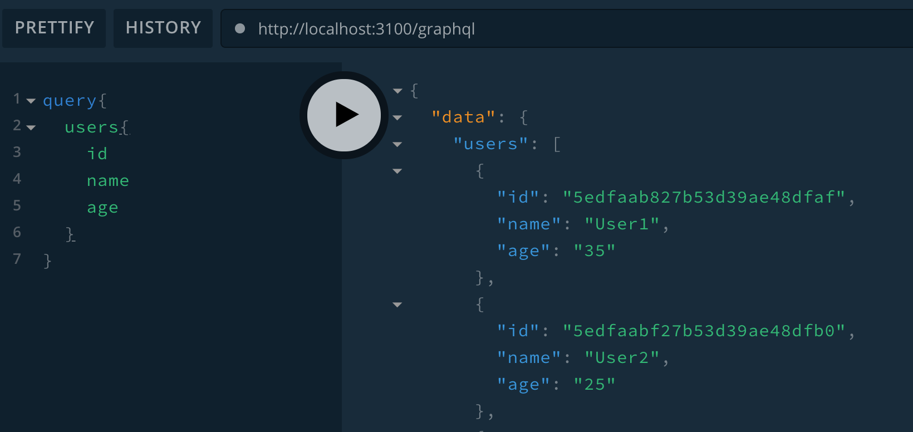
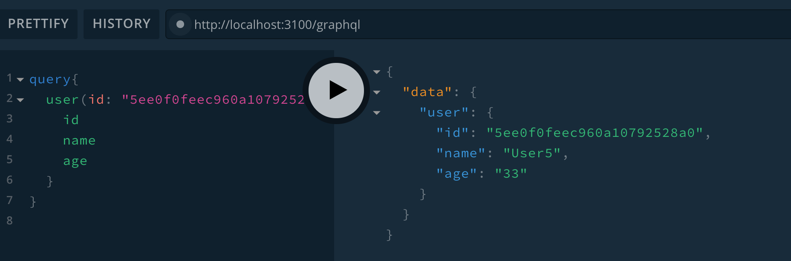
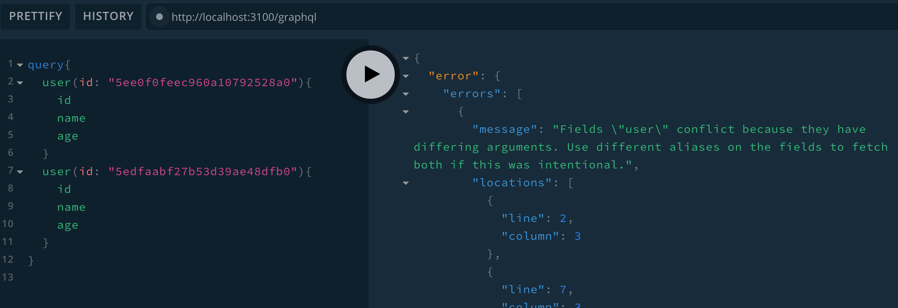
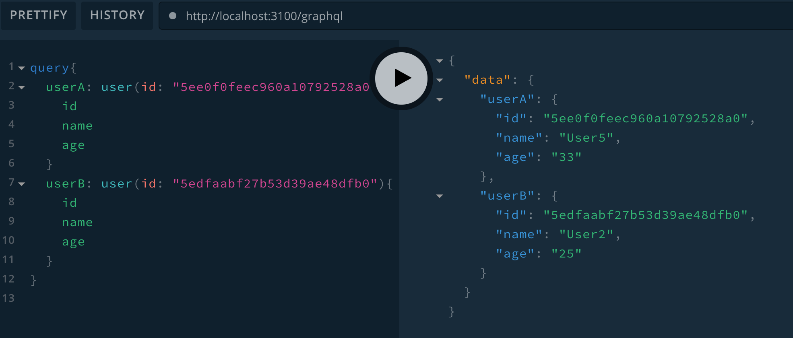
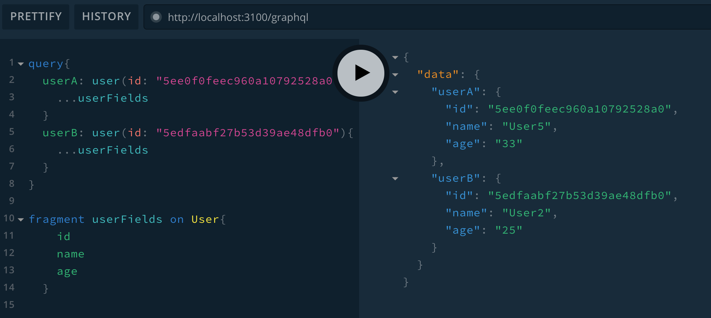
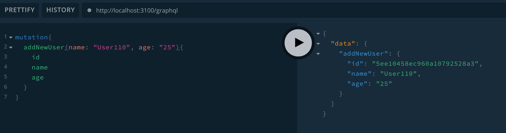
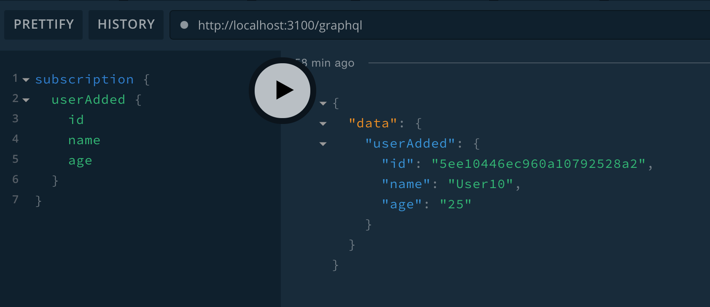
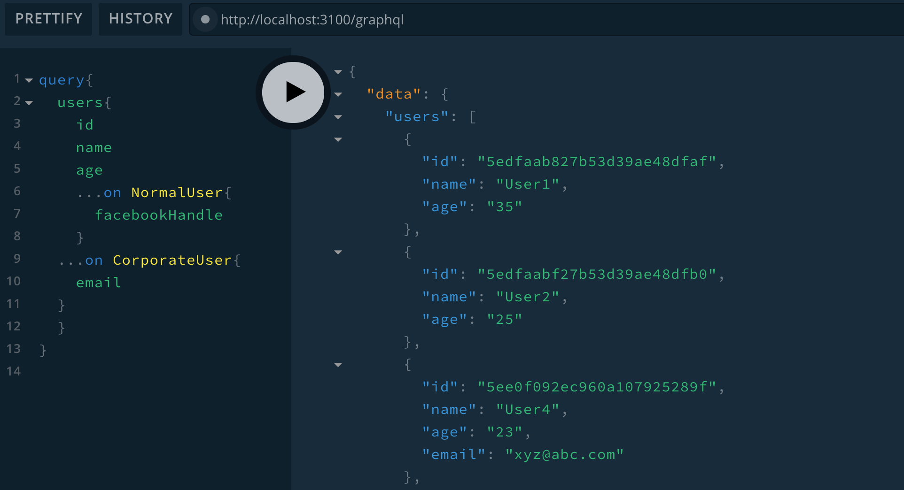

### 1. Install the following dependencies
```bash
npm i graphql apollo-server
```

### 2. Setup the Apollo graphql server in  the src/app.js using the code as shown below:
```js
const {ApolloServer} = require('apollo-server');
const typeDefs = require('./graphql/types');
const resolvers = require('./graphql/resolvers');

const server = new ApolloServer({
    typeDefs,
    resolvers
})

module.exports = server;
```
### 3. Now start the graphql server by adding the following line of code in src/index.js
```js
const server = require('./app');

server.listen({port: 3100}).then(({url}) => {
    console.log(`Graphql server is running at port ${url}`);
})
```
### 4. Implement the typeDefs  in src/graphql/types.js as shown below
```js
const {gql} = require('apollo-server');

const typeDefs = gql`
  type Query {
    users: [User]
  }

  type User {
    id: ID!
    name: String
    age: String
  }

  module.exports = typeDefs;
```

### 5. Now implement the resolver function for fetching the list of users
```js
const {fetchUsers} = require('../users');

const resolvers = {
    Query: {
        users: () => fetchUsers(),
    },
}
module.exports = resolvers;    
```
+ Implement the fetchUsers in the src/users/index.js file as shown below
```js
const axios = require('axios');

const instance = axios.create({
    baseURL: 'http://localhost:3000/',
    timeout: 1000
})

const fetchUsers = async () => {
    console.log('---inside fetchUsers ----');
    
    try {
        const {data} = await instance.get('/users');
        return data;
    } catch (e) {
        throw e;
    }
}
module.exports = {fetchUsers};
```
+ Here assumption is we have microservice (UserService) running at url http://localhost:3000/users
+ Now go the playground url and execute the query as shown below:


### 6. Let us implement another query with an argument support 
+ Add another query type in src/graphql/types.js as shown below:
```js
type Query {
    users: [User],
   + user(id: ID): User
  }
```
+ Add resolver function to support this query. Modify src/graphql/resolvers.js as shown below
```js
const {fetchUsers,  fetchUserById} = require('../users');
const resolvers = {
    Query: {
        users: () => fetchUsers(),
        user: (parent, args) => fetchUserById(args.id)
    },
}    
```
+ Now implement the fetchUserById function in the src/users/index.js
+ Here assumption is that there is an endpoint exposed by UserService at http://localhost:3000/users/id which returns the specific user information
```js
const fetchUserById = async (id) => {
    console.log('---fetchUserById ---',id);
    try {
        const {data} = await instance.get(`/users/${id}`);
        return data;
    } catch (e) {
      throw e;
    }    
}
```
+ Now go to the playground to execute the user query as shown below


### 7. Query by alias
+ Now let us run the query as shown below in the screenshot

+ This issue can be resolved by using different alias name for the user query. (See the screenshot)


### 8. Fragments
+ Fragments allows us to define the set of fields of particular Type and it can be reused in Query
+ This helps us avoid typing of query at multiple places. See the screenshot below


### 9. Define the Mutation
+ Let us add the GraphQL mutation to add new user
+ Modify the src/graphql/types.js as shown below:
```js
const typeDefs = gql`
  type Query {
    hello: String,
    users: [User],
    user(id: ID): User
  }

  type Mutation {
    addNewUser(name: String, age: String): User
  }
`  
```
+ Add the resolver function to support this new mutation in src/graphql/resolvers.js
```js
const {fetchUsers, createNewUser, fetchUserById} = require('../users');

const resolvers = {
    Query: {
        hello: () => 'Hello World',
        users: () => fetchUsers(),
        user: (parent, args) => fetchUserById(args.id)
    },
    Mutation: {
        addNewUser: async (parent, args) => {            
            const user = await createNewUser(args);            
            return user;
    },
},
}
```
+ Add the implementation of createNewUser in src/users/index.js as shown below
+ Here assumption is that UserService has an endpoint http://localhost:3000/users which supports POST operation for creating a new user
```js
const createNewUser = async (args) => {
    console.log('----args----',args);
    try {
        const {data} = await instance.post('/users', {
            name: args.name,
            age: args.age
        })
        return data;
    } catch (e) {
        throw e;
    }   
}
```
+ Execute the mutation query by going to the playground url as shown in the screenshot below:


### 10. Input type
+ Now if we have any mutation operation which takes lot of input field, then passing those fields as an argument is more cumbersome.
+ Graphql supports another type called input.
+ Let us define an input type in src/graphql/types.js
```js
input UserInput {
    name: String
    age: String
  }
```
+ Now modify the mutation type in src/graphql/types.js to use input type instead of raw argument as shown in code below:
```js
  type Mutation {
    addNewUser(user: UserInput): User
  }
```
+ This will require modification in the createNewUser function which is defined in src/users/index.js
```js
const createNewUser = async (args) => {
    console.log('----args----',args);
    try {
        const {data} = await instance.post('/users', {
            name: args.user.name,
            age: args.user.age
        })
        return data;
    } catch (e) {
        throw e;
    }    
}
```
### 11. Subscription type
+ Let us add a new npm dependency to support subscription 
```bash
npm i redis graphql-redis-subscriptions
```
+ To support subscription server let us modify the src/index.js file as shown below:
```js
server.listen({port: 3100}).then(({url, subscriptionsUrl}) => {
    console.log(`Graphql server is running at port ${url}`);
    console.log(`Graphql subscription is running at port ${subscriptionsUrl}`);  
})
```
+ Let us define subscription type in src/graphql/types.js as shown in code below
```js
type Subscription {
      userAdded: User
}
```
+ Let us define resolver function to support the subscription Operation.
```js
const {RedisPubSub} = require('graphql-redis-subscriptions');
const redis = require('redis');
const subscriber = redis.createClient();
const publisher = redis.createClient();

const USER_ADDED= 'USER_ADDED';

const pubsub = new RedisPubSub({
    publisher,
    subscriber
});
const resolvers = {
    Query: {
        ...
    },
    Mutation: {
        addNewUser: async (parent, args) => {            
            const user = await createNewUser(args);            
            await pubsub.publish(USER_ADDED, {userAdded: user});
            return user;
    },
},

Subscription: {
        userAdded: {
            subscribe: () => pubsub.asyncIterator([USER_ADDED])
        }
    },

}   
```
+ Here we are using the graphql redis subscription and underlying pubsub server as redis
+ Scenario is when a new user is added, we publish the new user information in the pubsub channel 'USER_ADDED' and subscriber is subscribing to the new event.
+ Execute this in the playground as shown in the screenshot below


### 12. Graphql Interface type
+ Let us refactor the User type in the src/graphql/types.js and make it an interface
+ Also let us provide three different implementation of User (CorporateUser, NormalUser, DefaultUser)
```js
interface User {
    id: ID!
    name: String
    age: String
  }

  type CorporateUser implements User {
    id: ID!
    name: String
    age: String
    email: String
  }
  type DefaultUser implements User {
    id: ID!
    name: String
    age: String
  }
  type NormalUser implements User {
    id: ID!
    name: String
    age: String
    facebookHandle: String
  }
```
+ Now we have to modify the resolver to make it understand which type of User implementation to be used while Querying
+ Add following line of code in src/graphql/resolvers.js just below the Subscription 
```js
  User: {
        __resolveType: (user, context, info) => {
            console.log('---user---',user);
            if (user.facebookHandle) {
                return 'NormalUser'
            }
            if (user.email) {
                return 'CorporateUser'
            }
            return 'DefaultUser';
        }
    }
```
+ Now go to the playground and execute the following query as shown in the screenshot below



